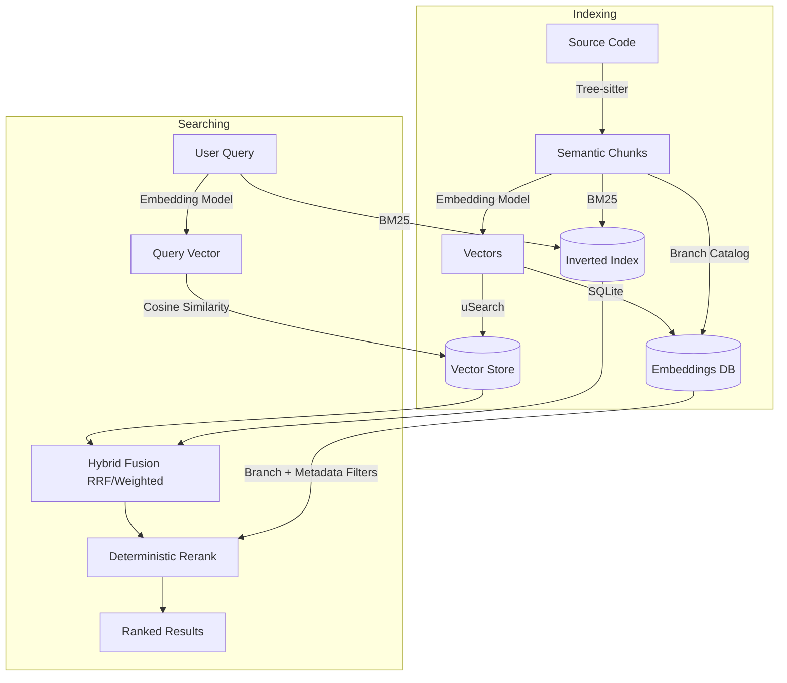

# opencode-codebase-index

[](https://www.npmjs.com/package/opencode-codebase-index)
[](https://opensource.org/licenses/MIT)
[](https://www.npmjs.com/package/opencode-codebase-index)
[](https://github.com/Helweg/opencode-codebase-index/actions)
[](https://nodejs.org/)

> **Stop grepping for concepts. Start searching for meaning.**

**opencode-codebase-index** brings semantic understanding to your [OpenCode](https://opencode.ai) workflow — and now to any MCP-compatible client like Cursor, Claude Code, and Windsurf. Instead of guessing function names or grepping for keywords, ask your codebase questions in plain English.

## 📌 Quick Navigation

- [⚡ Quick Start](#-quick-start)
- [🌐 MCP Server (Cursor, Claude Code, Windsurf, etc.)](#-mcp-server-cursor-claude-code-windsurf-etc)
- [🎯 When to Use What](#-when-to-use-what)
- [🧰 Tools Available](#-tools-available)
- [🎮 Slash Commands](#-slash-commands)
- [📚 Knowledge Base](#-knowledge-base)
- [🔄 Reranking](#-reranking)
- [⚙️ Configuration](#️-configuration)
- [🤝 Contributing](#-contributing)

## 👋 Choose Your Path

- **I want to try it now** → go to [Quick Start](#-quick-start)
- **I use Cursor/Claude Code/Windsurf** → go to [MCP Server setup](#-mcp-server-cursor-claude-code-windsurf-etc)
- **I’m comparing tools and workflows** → go to [When to Use What](#-when-to-use-what)
- **I’m tuning behavior/cost/performance** → go to [Configuration](#️-configuration)
- **I want to contribute** → go to [Contributing](#-contributing)

## 🚀 Why Use This?

- 🧠 **Semantic Search**: Finds "user authentication" logic even if the function is named `check_creds`.
- ⚡ **Blazing Fast Indexing**: Powered by a Rust native module using `tree-sitter` and `usearch`. Incremental updates take milliseconds.
- 🌿 **Branch-Aware**: Seamlessly handles git branch switches — reuses embeddings, filters stale results.
- 🔒 **Privacy Focused**: Your vector index is stored locally in your project.
- 🔌 **Model Agnostic**: Works out-of-the-box with GitHub Copilot, OpenAI, Gemini, or local Ollama models.
- 🌐 **MCP Server**: Use with Cursor, Claude Code, Windsurf, or any MCP-compatible client — index once, search from anywhere.

## ⚡ Quick Start

1. **Install the plugin**
   ```bash
   npm install opencode-codebase-index
   ```

2. **Add to `opencode.json`**
   ```json
   {
     "plugin": ["opencode-codebase-index"]
   }
   ```

3. **Index your codebase**
   Run `/index` or ask the agent to index your codebase. This only needs to be done once — subsequent updates are incremental.

4. **Start Searching**
   Ask:
   > "Find the function that handles credit card validation errors"

## 🌐 MCP Server (Cursor, Claude Code, Windsurf, etc.)

Use the same semantic search from any MCP-compatible client. Index once, search from anywhere.

1. **Install dependencies**
   ```bash
   npm install opencode-codebase-index @modelcontextprotocol/sdk zod
   ```

2. **Configure your MCP client**

   **Cursor** (`.cursor/mcp.json`):
   ```json
   {
     "mcpServers": {
       "codebase-index": {
         "command": "npx",
         "args": ["opencode-codebase-index-mcp", "--project", "/path/to/your/project"]
       }
     }
   }
   ```

   **Claude Code** (`claude_desktop_config.json`):
   ```json
   {
     "mcpServers": {
       "codebase-index": {
         "command": "npx",
         "args": ["opencode-codebase-index-mcp", "--project", "/path/to/your/project"]
       }
     }
   }
   ```

3. **CLI options**
   ```bash
   npx opencode-codebase-index-mcp --project /path/to/repo    # specify project root
   npx opencode-codebase-index-mcp --config /path/to/config   # custom config file
   npx opencode-codebase-index-mcp                            # uses current directory
   ```

The MCP server exposes all 9 tools (`codebase_search`, `codebase_peek`, `find_similar`, `call_graph`, `index_codebase`, `index_status`, `index_health_check`, `index_metrics`, `index_logs`) and 4 prompts (`search`, `find`, `index`, `status`).

The MCP dependencies (`@modelcontextprotocol/sdk`, `zod`) are optional peer dependencies — they're only needed if you use the MCP server.

## 🔍 See It In Action

**Scenario**: You're new to a codebase and need to fix a bug in the payment flow.

**Without Plugin (grep)**:
- `grep "payment" .` → 500 results (too many)
- `grep "card" .` → 200 results (mostly UI)
- `grep "stripe" .` → 50 results (maybe?)

**With `opencode-codebase-index`**:
You ask: *"Where is the payment validation logic?"*

Plugin returns:
```text
src/services/billing.ts:45  (Class PaymentValidator)
src/utils/stripe.ts:12      (Function validateCardToken)
src/api/checkout.ts:89      (Route handler for /pay)
```

## 🎯 When to Use What

| Scenario | Tool | Why |
|----------|------|-----|
| Don't know the function name | `codebase_search` | Semantic search finds by meaning |
| Exploring unfamiliar codebase | `codebase_search` | Discovers related code across files |
| Just need to find locations | `codebase_peek` | Returns metadata only, saves ~90% tokens |
| Understand code flow | `call_graph` | Find callers/callees of any function |
| Know exact identifier | `grep` | Faster, finds all occurrences |
| Need ALL matches | `grep` | Semantic returns top N only |
| Mixed discovery + precision | `/find` (hybrid) | Best of both worlds |

**Rule of thumb**: `codebase_peek` to find locations → `Read` to examine → `grep` for precision.

## 📊 Token Usage

In our testing across open-source codebases (axios, express), we observed **up to 90% reduction in token usage** for conceptual queries like *"find the error handling middleware"*.

### Why It Saves Tokens

- **Without plugin**: Agent explores files, reads code, backtracks, explores more
- **With plugin**: Semantic search returns relevant code immediately → less exploration

### Key Takeaways

1. **Significant savings possible**: Up to 90% reduction in the best cases
2. **Results vary**: Savings depend on query type, codebase structure, and agent behavior
3. **Best for discovery**: Conceptual queries benefit most; exact identifier lookups should use grep
4. **Complements existing tools**: Provides a faster initial signal, doesn't replace grep/explore

### When the Plugin Helps Most

- **Conceptual queries**: "Where is the authentication logic?" (no keywords to grep for)
- **Unfamiliar codebases**: You don't know what to search for yet
- **Large codebases**: Semantic search scales better than exhaustive exploration

## 🛠️ How It Works



1. **Parsing**: We use `tree-sitter` to intelligently parse your code into meaningful blocks (functions, classes, interfaces). JSDoc comments and docstrings are automatically included with their associated code.

**Supported Languages (Tree-sitter semantic parsing)**: TypeScript, JavaScript, Python, Rust, Go, Java, C#, Ruby, PHP, Bash, C, C++, JSON, TOML, YAML

**Additional Supported Formats (line-based chunking)**: TXT, HTML, HTM, Markdown, Shell scripts

**Default File Patterns**:
```
**/*.{ts,tsx,js,jsx,mjs,cjs}    **/*.{py,pyi}
**/*.{go,rs,java,kt,scala}      **/*.{c,cpp,cc,h,hpp}
**/*.{rb,php,inc,swift}         **/*.{vue,svelte,astro}
**/*.{sql,graphql,proto}        **/*.{yaml,yml,toml}
**/*.{md,mdx}                   **/*.{sh,bash,zsh}
**/*.{txt,html,htm}
```

Use `include` to replace defaults, or `additionalInclude` to extend (e.g. `"**/*.pdf"`, `"**/*.csv"`).

**Max File Size**: Default 1MB (1048576 bytes). Configure via `indexing.maxFileSize` (bytes).
2. **Chunking**: Large blocks are split with overlapping windows to preserve context across chunk boundaries.
3. **Embedding**: These blocks are converted into vector representations using your configured AI provider.
4. **Storage**: Embeddings are stored in SQLite (deduplicated by content hash) and vectors in `usearch` with F16 quantization for 50% memory savings. A branch catalog tracks which chunks exist on each branch.
5. **Hybrid Search**: Combines semantic similarity (vectors) with BM25 keyword matching, fuses (`rrf` default, `weighted` fallback), applies deterministic rerank, then filters by current branch/metadata.

**Performance characteristics:**
- **Incremental indexing**: ~50ms check time — only re-embeds changed files
- **Smart chunking**: Understands code structure to keep functions whole, with overlap for context
- **Native speed**: Core logic written in Rust for maximum performance
- **Memory efficient**: F16 vector quantization reduces index size by 50%
- **Branch-aware**: Automatically tracks which chunks exist on each git branch
- **Provider validation**: Detects embedding provider/model changes and requires rebuild to prevent garbage results

## 🌿 Branch-Aware Indexing

The plugin automatically detects git branches and optimizes indexing across branch switches.

### How It Works

When you switch branches, code changes but embeddings for unchanged content remain the same. The plugin:

1. **Stores embeddings by content hash**: Embeddings are deduplicated across branches
2. **Tracks branch membership**: A lightweight catalog tracks which chunks exist on each branch
3. **Filters search results**: Queries only return results relevant to the current branch

### Benefits

| Scenario | Without Branch Awareness | With Branch Awareness |
|----------|-------------------------|----------------------|
| Switch to feature branch | Re-index everything | Instant — reuse existing embeddings |
| Return to main | Re-index everything | Instant — catalog already exists |
| Search on branch | May return stale results | Only returns current branch's code |

### Automatic Behavior

- **Branch detection**: Automatically reads from `.git/HEAD`
- **Re-indexing on switch**: Triggers when you switch branches (via file watcher)
- **Legacy migration**: Automatically migrates old indexes on first run
- **Garbage collection**: Health check removes orphaned embeddings and chunks

### Storage Structure

```
.opencode/index/
├── codebase.db           # SQLite: embeddings, chunks, branch catalog, symbols, call edges
├── vectors.usearch       # Vector index (uSearch)
├── inverted-index.json   # BM25 keyword index
└── file-hashes.json      # File change detection
```

### File Exclusions

The following files/folders are excluded from indexing by default:

- **Hidden files/folders**: Files starting with `.` (e.g., `.github`, `.vscode`, `.env`)
- **Build folders**: Folders containing "build" in their name (e.g., `build`, `mingwBuildDebug`, `cmake-build-debug`)
- **Default excludes**: `node_modules`, `dist`, `vendor`, `__pycache__`, `target`, `coverage`, etc.

## 🧰 Tools Available

The plugin exposes these tools to the OpenCode agent:

### `codebase_search`
**The primary tool.** Searches code by describing behavior.
- **Use for**: Discovery, understanding flows, finding logic when you don't know the names.
- **Example**: `"find the middleware that sanitizes input"`
- **Ranking path**: hybrid retrieval → fusion (`search.fusionStrategy`) → deterministic rerank (`search.rerankTopN`) → filters

**Writing good queries:**

| ✅ Good queries (describe behavior) | ❌ Bad queries (too vague) |
|-------------------------------------|---------------------------|
| "function that validates email format" | "email" |
| "error handling for failed API calls" | "error" |
| "middleware that checks authentication" | "auth middleware" |
| "code that calculates shipping costs" | "shipping" |
| "where user permissions are checked" | "permissions" |

### `codebase_peek`
**Token-efficient discovery.** Returns only metadata (file, line, name, type) without code content.
- **Use for**: Finding WHERE code is before deciding what to read. Saves ~90% tokens vs `codebase_search`.
- **Ranking path**: same hybrid ranking path as `codebase_search` (metadata-only output)
- **Example output**:
  ```
  [1] function "validatePayment" at src/billing.ts:45-67 (score: 0.92)
  [2] class "PaymentProcessor" at src/processor.ts:12-89 (score: 0.87)
  
  Use Read tool to examine specific files.
  ```
- **Workflow**: `codebase_peek` → find locations → `Read` specific files

### `find_similar`
Find code similar to a provided snippet.
- **Use for**: Duplicate detection, refactor prep, pattern mining.
- **Ranking path**: semantic retrieval only + deterministic rerank (no BM25, no RRF).

### `index_codebase`
Manually trigger indexing.
- **Use for**: Forcing a re-index or checking stats.
- **Parameters**: `force` (rebuild all), `estimateOnly` (check costs), `verbose` (show skipped files and parse failures).

### `index_status`
Checks if the index is ready and healthy.

### `index_health_check`
Maintenance tool to remove stale entries from deleted files and orphaned embeddings/chunks from the database.

### `index_metrics`
Returns collected metrics about indexing and search performance. Requires `debug.enabled` and `debug.metrics` to be `true`.
- **Metrics include**: Files indexed, chunks created, cache hit rate, search timing breakdown, GC stats, embedding API call stats.

### `index_logs`
Returns recent debug logs with optional filtering.
- **Parameters**: `category` (optional: `search`, `embedding`, `cache`, `gc`, `branch`), `level` (optional: `error`, `warn`, `info`, `debug`), `limit` (default: 50).

### `call_graph`
Query the call graph to find callers or callees of a function/method. Automatically built during indexing for TypeScript, JavaScript, Python, Go, and Rust.
- **Use for**: Understanding code flow, tracing dependencies, impact analysis.
- **Parameters**: `name` (function name), `direction` (`callers` or `callees`), `symbolId` (required for `callees`, returned by previous queries).
- **Example**: Find who calls `validateToken` → `call_graph(name="validateToken", direction="callers")`

### `add_knowledge_base`
Add a folder as a knowledge base to be indexed alongside project code.
- **Use for**: Indexing external documentation, API references, example programs.
- **Parameters**: `path` (folder path, absolute or relative), `reindex` (optional, default `true`).
- **Example**: `add_knowledge_base(path="/path/to/docs")`

### `list_knowledge_bases`
List all configured knowledge base folders and their status.

### `remove_knowledge_base`
Remove a knowledge base folder from the index.
- **Parameters**: `path` (folder path to remove), `reindex` (optional, default `false`).
- **Example**: `remove_knowledge_base(path="/path/to/docs")`

## 🎮 Slash Commands

The plugin automatically registers these slash commands:

| Command | Description |
| ------- | ----------- |
| `/search <query>` | **Pure Semantic Search**. Best for "How does X work?" |
| `/find <query>` | **Hybrid Search**. Combines semantic search + grep. Best for "Find usage of X". |
| `/call-graph <query>` | **Call Graph Trace**. Find callers/callees to understand execution flow. |
| `/index` | **Update Index**. Forces a refresh of the codebase index. |
| `/status` | **Check Status**. Shows if indexed, chunk count, and provider info. |

## 📚 Knowledge Base

The plugin can index **external documentation** alongside your project code. The indexed codebase includes:

- **Project Source Code** — all code files in the current workspace
- **API References** — hardware API docs, library documentation
- **Usage Guides** — tutorials, how-to guides
- **Example Programs** — code samples, demo projects

### Adding Knowledge Base Folders

Use the built-in tools to add documentation folders:

```
add_knowledge_base(path="/path/to/api-docs")
add_knowledge_base(path="/path/to/examples")
```

The folder will be indexed into the **same database** as your project code. All searches automatically include both sources.

### Managing Knowledge Bases

```
list_knowledge_bases          # Show configured knowledge bases
remove_knowledge_base(path="/path/to/api-docs")  # Remove a knowledge base
```

### Configuration Example

Project-level config (`.opencode/codebase-index.json`):
```json
{
  "knowledgeBases": [
    "/home/user/docs/esp-idf",
    "/home/user/docs/arduino"
  ]
}
```

Global-level config (`~/.config/opencode/codebase-index.json`):
```json
{
  "embeddingProvider": "custom",
  "customProvider": {
    "baseUrl": "https://api.siliconflow.cn/v1",
    "model": "BAAI/bge-m3",
    "dimensions": 1024,
    "apiKey": "{env:SILICONFLOW_API_KEY}"
  }
}
```

Config merging: Global config is the base, project config overrides. Knowledge bases from both levels are merged.

### Syncing Changes

- **Project code**: Auto-synced via file watcher (real-time)
- **Knowledge base folders**: Manual sync — run `/index force` after changes

## 🔄 Reranking

The plugin supports **API-based reranking** for improved search result quality. Reranking uses a cross-encoder model to rescore the top search results.

### Enable Reranking

Add to your config (`.opencode/codebase-index.json` or global config):

```json
{
  "reranker": {
    "enabled": true,
    "baseUrl": "https://api.siliconflow.cn/v1",
    "model": "BAAI/bge-reranker-v2-m3",
    "apiKey": "{env:SILICONFLOW_API_KEY}",
    "topN": 20
  }
}
```

### Reranker Options

| Option | Default | Description |
|--------|---------|-------------|
| `enabled` | `false` | Enable reranking |
| `baseUrl` | - | Rerank API endpoint |
| `model` | - | Reranking model name |
| `apiKey` | - | API key (use `{env:VAR}` for security) |
| `topN` | `20` | Number of top results to rerank |
| `timeoutMs` | `30000` | Request timeout |

### How It Works

```
Query → Embedding Search → BM25 Search → Fusion → Reranking → Results
```

1. **Embedding Search**: Semantic similarity via vector search
2. **BM25 Search**: Keyword matching via inverted index
3. **Fusion**: Combine semantic + keyword results (RRF or weighted)
4. **Reranking**: Cross-encoder rescores top N results via API
5. **Results**: Final ranked results

### Supported Reranking APIs

Any OpenAI-compatible reranking endpoint. Examples:
- **SiliconFlow**: `BAAI/bge-reranker-v2-m3`
- **Cohere**: `rerank-english-v3.0`
- **Local models**: Any server implementing `/v1/rerank` format

## ⚙️ Configuration

Zero-config by default (uses `auto` mode). Customize in `.opencode/codebase-index.json`:

### Full Configuration Example

```json
{
  // === Embedding Provider ===
  "embeddingProvider": "custom",              // auto | github-copilot | openai | google | ollama | custom
  "scope": "project",                         // project (per-repo) | global (shared)

  // === Custom Embedding API (when embeddingProvider is "custom") ===
  "customProvider": {
    "baseUrl": "https://api.siliconflow.cn/v1",
    "model": "BAAI/bge-m3",
    "dimensions": 1024,
    "apiKey": "{env:SILICONFLOW_API_KEY}",
    "maxTokens": 8192,                        // Max tokens per input text
    "timeoutMs": 30000,                       // Request timeout (ms)
    "concurrency": 3,                         // Max concurrent requests
    "requestIntervalMs": 1000,                // Min delay between requests (ms)
    "maxBatchSize": 64                        // Max inputs per /embeddings request
  },

  // === File Patterns ===
  "include": [                                // Override default include patterns
    "**/*.{ts,js,py,go,rs}"
  ],
  "exclude": [                                // Override default exclude patterns
    "**/node_modules/**"
  ],
  "additionalInclude": [                      // Extend defaults (not replace)
    "**/*.{txt,html,htm}",
    "**/*.pdf"
  ],

  // === Knowledge Bases ===
  "knowledgeBases": [                         // External docs to index alongside code
    "/home/user/docs/esp-idf",
    "/home/user/docs/arduino"
  ],

  // === Indexing ===
  "indexing": {
    "autoIndex": false,                       // Auto-index on plugin load
    "watchFiles": true,                       // Re-index on file changes
    "maxFileSize": 1048576,                   // Max file size in bytes (default: 1MB)
    "maxChunksPerFile": 100,                  // Max chunks per file
    "semanticOnly": false,                    // Only index functions/classes (skip blocks)
    "retries": 3,                             // Embedding API retry attempts
    "retryDelayMs": 1000,                     // Delay between retries (ms)
    "autoGc": true,                           // Auto garbage collection
    "gcIntervalDays": 7,                      // GC interval (days)
    "gcOrphanThreshold": 100,                 // GC trigger threshold
    "requireProjectMarker": true              // Require .git/package.json to index
  },

  // === Search ===
  "search": {
    "maxResults": 20,                         // Max results to return
    "minScore": 0.1,                          // Min similarity score (0-1)
    "hybridWeight": 0.5,                      // Keyword (1.0) vs semantic (0.0)
    "fusionStrategy": "rrf",                  // rrf | weighted
    "rrfK": 60,                               // RRF smoothing constant
    "rerankTopN": 20,                         // Deterministic rerank depth
    "contextLines": 0                         // Extra lines before/after match
  },

  // === Reranking API ===
  "reranker": {
    "enabled": true,                          // Enable API reranking
    "baseUrl": "https://api.siliconflow.cn/v1",
    "model": "BAAI/bge-reranker-v2-m3",
    "apiKey": "{env:SILICONFLOW_API_KEY}",
    "topN": 20,                               // Number of results to rerank
    "timeoutMs": 30000                        // Request timeout (ms)
  },

  // === Debug ===
  "debug": {
    "enabled": false,                         // Enable debug logging
    "logLevel": "info",                       // error | warn | info | debug
    "logSearch": true,                        // Log search operations
    "logEmbedding": true,                     // Log embedding API calls
    "logCache": true,                         // Log cache hits/misses
    "logGc": true,                            // Log garbage collection
    "logBranch": true,                        // Log branch detection
    "metrics": false                          // Enable metrics collection
  }
}
```

String values in `codebase-index.json` can reference environment variables with `{env:VAR_NAME}` when the placeholder is the entire string value. Variable names must match `[A-Z_][A-Z0-9_]*`. This is useful for secrets such as custom provider API keys so they do not need to be committed to the config file.

```json
{
  "embeddingProvider": "custom",
  "customProvider": {
    "baseUrl": "{env:EMBED_BASE_URL}",
    "model": "nomic-embed-text",
    "dimensions": 768,
    "apiKey": "{env:EMBED_API_KEY}"
  }
}
```

### Options Reference

| Option | Default | Description |
|--------|---------|-------------|
| `embeddingProvider` | `"auto"` | Which AI to use: `auto`, `github-copilot`, `openai`, `google`, `ollama`, `custom` |
| `scope` | `"project"` | `project` = index per repo, `global` = shared index across repos |
| `include` | (defaults) | Override the default include patterns (replaces defaults) |
| `exclude` | (defaults) | Override the default exclude patterns (replaces defaults) |
| `additionalInclude` | `[]` | Additional file patterns to include (extends defaults, e.g. `"**/*.txt"`, `"**/*.html"`) |
| `knowledgeBases` | `[]` | External directories to index as knowledge bases (absolute or relative paths) |
| **indexing** | | |
| `autoIndex` | `false` | Automatically index on plugin load |
| `watchFiles` | `true` | Re-index when files change |
| `maxFileSize` | `1048576` | Skip files larger than this (bytes). Default: 1MB |
| `maxChunksPerFile` | `100` | Maximum chunks to index per file (controls token costs for large files) |
| `semanticOnly` | `false` | When `true`, only index semantic nodes (functions, classes) and skip generic blocks |
| `retries` | `3` | Number of retry attempts for failed embedding API calls |
| `retryDelayMs` | `1000` | Delay between retries in milliseconds |
| `autoGc` | `true` | Automatically run garbage collection to remove orphaned embeddings/chunks |
| `gcIntervalDays` | `7` | Run GC on initialization if last GC was more than N days ago |
| `gcOrphanThreshold` | `100` | Run GC after indexing if orphan count exceeds this threshold |
| `requireProjectMarker` | `true` | Require a project marker (`.git`, `package.json`, etc.) to enable file watching and auto-indexing. Prevents accidentally indexing large directories like home. Set to `false` to index any directory. |
| **search** | | |
| `maxResults` | `20` | Maximum results to return |
| `minScore` | `0.1` | Minimum similarity score (0-1). Lower = more results |
| `hybridWeight` | `0.5` | Balance between keyword (1.0) and semantic (0.0) search |
| `fusionStrategy` | `"rrf"` | Hybrid fusion mode: `"rrf"` (rank-based reciprocal rank fusion) or `"weighted"` (legacy score blending fallback) |
| `rrfK` | `60` | RRF smoothing constant. Higher values flatten rank impact, lower values prioritize top-ranked candidates more strongly |
| `rerankTopN` | `20` | Deterministic rerank depth cap. Applies lightweight name/path/chunk-type rerank to top-N only |
| `contextLines` | `0` | Extra lines to include before/after each match |
| **reranker** | | |
| `reranker.enabled` | `false` | Enable API-based reranking |
| `reranker.baseUrl` | - | Rerank API endpoint URL |
| `reranker.model` | - | Reranking model name (e.g. `BAAI/bge-reranker-v2-m3`) |
| `reranker.apiKey` | - | API key for reranking service (use `{env:VAR}` for security) |
| `reranker.topN` | `20` | Number of top results to rerank via API |
| `reranker.timeoutMs` | `30000` | Rerank API request timeout in milliseconds |
| **customProvider** | | |
| `customProvider.baseUrl` | - | Base URL of OpenAI-compatible embeddings API (e.g. `https://api.siliconflow.cn/v1`) |
| `customProvider.model` | - | Model name (e.g. `BAAI/bge-m3`, `nomic-embed-text`) |
| `customProvider.dimensions` | - | Vector dimensions (e.g. `1024` for BGE-M3, `768` for nomic-embed-text) |
| `customProvider.apiKey` | - | API key (use `{env:VAR}` for security) |
| `customProvider.maxTokens` | `8192` | Max tokens per input text |
| `customProvider.timeoutMs` | `30000` | Request timeout in milliseconds |
| `customProvider.concurrency` | `3` | Max concurrent embedding requests |
| `customProvider.requestIntervalMs` | `1000` | Minimum delay between requests (ms). Set to `0` for local servers |
| `customProvider.maxBatchSize` | - | Max inputs per `/embeddings` request. Cap for servers with batch limits |
| **debug** | | |
| `enabled` | `false` | Enable debug logging and metrics collection |
| `logLevel` | `"info"` | Log level: `error`, `warn`, `info`, `debug` |
| `logSearch` | `true` | Log search operations with timing breakdown |
| `logEmbedding` | `true` | Log embedding API calls (success, error, rate-limit) |
| `logCache` | `true` | Log cache hits and misses |
| `logGc` | `true` | Log garbage collection operations |
| `logBranch` | `true` | Log branch detection and switches |
| `metrics` | `false` | Enable metrics collection (indexing stats, search timing, cache performance) |

### Retrieval ranking behavior

- `codebase_search` and `codebase_peek` use the hybrid path: semantic + keyword retrieval → fusion (`fusionStrategy`) → deterministic rerank (`rerankTopN`) → filtering.
- `find_similar` stays semantic-only: semantic retrieval + deterministic rerank only (no keyword retrieval, no RRF).
- For compatibility rollbacks, set `search.fusionStrategy` to `"weighted"` to use the legacy weighted fusion path.
- Retrieval benchmark artifacts are separated by role:
  - baseline (versioned): `benchmarks/baselines/retrieval-baseline.json`
  - latest candidate run (generated): `benchmark-results/retrieval-candidate.json`

## 📏 Evaluation Harness

This repository includes a first-class eval system for retrieval quality with versioned golden sets, compare mode, parameter sweeps, CI budgets, and run artifacts.

### Commands

```bash
npm run eval
npm run eval:ci
npm run eval:ci:ollama
npm run eval:compare -- --against benchmarks/baselines/eval-baseline-summary.json
```

CI usage split:

- `npm run eval:smoke`: harness smoke check with local mock embeddings (used in main CI)
- `npm run eval:ci`: real quality gate against baseline/budget (for scheduled/manual quality workflow)

For `eval-quality.yml`, the default CI path uses **GitHub Models** with the workflow `GITHUB_TOKEN` plus `models: read`, so you do not need a separate OpenAI API key just to run the scheduled gate.

That default GitHub Models path uses `benchmarks/budgets/github-models.json`, which applies stable absolute thresholds instead of the stricter baseline-regression budget used for explicit external providers.

Optional override secrets for another OpenAI-compatible endpoint:

- `EVAL_EMBED_BASE_URL`
- `EVAL_EMBED_API_KEY`
- `EVAL_EMBED_MODEL` (optional, default `text-embedding-3-small`)
- `EVAL_EMBED_DIMENSIONS` (optional, default `1536`)

If you override the provider, set both `EVAL_EMBED_BASE_URL` and `EVAL_EMBED_API_KEY`. Otherwise the workflow falls back to GitHub Models automatically. Override providers continue to use the baseline-driven budget in `benchmarks/budgets/default.json`.

No OpenAI API access? Use Ollama quality gate locally:

- Config: `.github/eval-ollama-config.json`
- Script: `npm run eval:ci:ollama`

Prerequisites: Ollama installed, `ollama serve` running on `127.0.0.1:11434`, and `nomic-embed-text` pulled.

Examples:

```bash
# Run against small golden set
npm run eval -- --dataset benchmarks/golden/small.json

# Compare against baseline
npm run eval:compare -- --against benchmarks/baselines/eval-baseline-summary.json --dataset benchmarks/golden/medium.json

# Sweep retrieval parameters
npm run eval -- --dataset benchmarks/golden/small.json --sweepFusionStrategy rrf,weighted --sweepHybridWeight 0.3,0.5,0.7 --sweepRrfK 30,60 --sweepRerankTopN 10,20
```

### What it reports

- Hit@1, Hit@3, Hit@5, Hit@10
- MRR@10, nDCG@10
- Latency p50/p95/p99
- Token estimates, embedding call counts, estimated embedding cost
- Failure buckets (`wrong-file`, `wrong-symbol`, `docs-tests-outranking-source`, `no-relevant-hit-top-k`)

### Artifacts

Each run writes:

`benchmarks/results/<timestamp>/`

- `summary.json`
- `summary.md`
- `per-query.json`
- `compare.json` (when baseline/sweep used)

### Golden sets and budgets

- Golden datasets:
  - `benchmarks/golden/small.json`
  - `benchmarks/golden/medium.json`
  - `benchmarks/golden/large.json`
- CI budgets:
  - `benchmarks/budgets/github-models.json` for the default GitHub Models workflow path
  - `benchmarks/budgets/default.json` for explicit external provider overrides with baseline comparison

Full docs: `docs/evaluation.md`

### Cross-repo benchmark results snapshot

Recent representative runs (plugin vs `ripgrep` vs `ast-grep`) on two medium repos:

Methodology for the snapshot below:

- Dataset: auto-generated cross-repo golden sets for `axios` + `express`
- Repeats: **20** per mode
- Aggregation: **median** metric per tool (then averaged across repos)
- Reindex behavior: when enabled, index reset applies on repeat #1 only; subsequent repeats measure warm-index query behavior
- Sampling note: repository parsing can be capped; benchmark reports include truncation metadata
- ast-grep scope note: sg metrics are computed on its compatible query subset (`definition`, `keyword-heavy`) with scoped denominators shown in run reports

#### Without reindex (`--no-reindex`, default)

| Metric | Plugin | ripgrep | ast-grep (5/10 queries) |
|---|---:|---:|---:|
| Hit@5 | 50% | 5% | 100% |
| MRR@10 | 0.48 | 0.04 | 0.90 |
| nDCG@10 | 0.48 | 0.08 | 0.93 |
| Latency p50 (ms) | 17.5 | 36.9 | 66.6 |
| Latency p95 (ms) | 30.9 | 44.1 | 70.7 |

#### With reindex (`--reindex`)

| Metric | Plugin | ripgrep | ast-grep (5/10 queries) |
|---|---:|---:|---:|
| Hit@5 | 50% | 5% | 100% |
| MRR@10 | 0.48 | 0.04 | 0.98 |
| nDCG@10 | 0.48 | 0.07 | 0.98 |
| Latency p50 (ms) | 17.1 | 35.9 | 69.1 |
| Latency p95 (ms) | 30.4 | 43.7 | 75.1 |

ast-grep metrics are computed on its compatible query subset only (`definition` + `keyword-heavy`, 5/10 queries per repo). Plugin and ripgrep are scored on all 10 queries.

Interpretation:

- ast-grep dominates on its scoped subset (structural definition queries), but only handles 50% of query types. Plugin handles all query types including natural language.
- Plugin leads on rank-sensitive quality (MRR/nDCG) vs ripgrep across all query types.
- ripgrep remains a useful speed-oriented lexical baseline but has significantly lower retrieval relevance for intent-style queries.
- Plugin is the fastest tool at p50 (~17ms), ahead of ripgrep (~36ms) and ast-grep (~67ms).
- Reported numbers are rounded to avoid false precision; use report artifacts for full per-repeat audit trails.

For reproducible setup and commands (including with/without reindex), see:

- `docs/benchmarking-cross-repo.md`

### Embedding Providers
The plugin automatically detects available credentials in this order:
1. **GitHub Copilot** (Free if you have it)
2. **OpenAI** (Standard Embeddings)
3. **Google** (Gemini Embeddings)
4. **Ollama** (Local/Private - requires `nomic-embed-text`)

You can also use **Custom** to connect any OpenAI-compatible embedding endpoint (llama.cpp, vLLM, text-embeddings-inference, LiteLLM, etc.).

### Rate Limits by Provider

Each provider has different rate limits. The plugin automatically adjusts concurrency and delays:

| Provider | Concurrency | Delay | Best For |
|----------|-------------|-------|----------|
| **GitHub Copilot** | 1 | 4s | Small codebases (<1k files) |
| **OpenAI** | 3 | 500ms | Medium codebases |
| **Google** | 5 | 200ms | Medium-large codebases |
| **Ollama** | 5 | None | Large codebases (10k+ files) |
| **Custom** | 3 | 1s | Any OpenAI-compatible endpoint |

**For large codebases**, use Ollama locally to avoid rate limits:

```bash
# Install the embedding model
ollama pull nomic-embed-text
```

```json
// .opencode/codebase-index.json
{
  "embeddingProvider": "ollama"
}
```

## 📈 Performance

The plugin is built for speed with a Rust native module (`tree-sitter`, `usearch`, SQLite). In practice, indexing and retrieval remain fast enough for interactive use on medium/large repositories.

- Typical query latency: ~800-1000ms (mostly embedding API time)
- Incremental indexing: only changed files are re-embedded
- Batch DB operations: significant write-speed improvements for large indexes

For reproducible measurements on your machine, run: `npx tsx benchmarks/run.ts`.

## 🎯 Choosing a Provider

Quick recommendation:

- **Want local + private + fast indexing** → use **Ollama**
- **Already have Copilot and a smaller repo** → use **GitHub Copilot**
- **General cloud setup** → use **OpenAI** or **Google**
- **Custom/OpenAI-compatible endpoint** → use **custom** provider

### Provider Comparison

| Provider | Speed | Cost | Privacy | Best For |
|----------|-------|------|---------|----------|
| **Ollama** | Fastest | Free | Full | Large codebases, privacy-sensitive |
| **GitHub Copilot** | Slow (rate limited) | Free* | Cloud | Small codebases, existing subscribers |
| **OpenAI** | Medium | ~$0.0001/1K tokens | Cloud | General use |
| **Google** | Fast | Free tier available | Cloud | Medium-large codebases |
| **Custom** | Varies | Varies | Varies | Self-hosted or third-party endpoints |

*Requires active Copilot subscription

### Setup by Provider

Set the provider in `.opencode/codebase-index.json`:

```json
{ "embeddingProvider": "ollama" }
```

Credentials (if required) are read from environment variables (for example `OPENAI_API_KEY` or `GOOGLE_API_KEY`).

**Custom (OpenAI-compatible)**
Works with any server that implements the OpenAI `/v1/embeddings` API format (llama.cpp, vLLM, text-embeddings-inference, LiteLLM, etc.).
```json
{
  "embeddingProvider": "custom",
  "customProvider": {
    "baseUrl": "{env:EMBED_BASE_URL}",
    "model": "nomic-embed-text",
    "dimensions": 768,
    "apiKey": "{env:EMBED_API_KEY}",
    "maxTokens": 8192,
    "timeoutMs": 30000,
    "maxBatchSize": 64
  }
}
```
Required fields: `baseUrl`, `model`, `dimensions` (positive integer). Optional: `apiKey`, `maxTokens`, `timeoutMs` (default: 30000), `maxBatchSize` (or `max_batch_size`) to cap inputs per `/embeddings` request for servers like text-embeddings-inference. `{env:VAR_NAME}` placeholders are resolved before config validation for fields that are actually used and throw if the referenced environment variable is missing or malformed.

## ⚠️ Tradeoffs

Be aware of these characteristics:

| Aspect | Reality |
|--------|---------|
| **Search latency** | ~800-1000ms per query (embedding API call) |
| **First index** | Takes time depending on codebase size (e.g., ~30s for 500 chunks) |
| **Requires API** | Needs an embedding provider (Copilot, OpenAI, Google, or local Ollama) |
| **Token costs** | Uses embedding tokens (free with Copilot, minimal with others) |
| **Best for** | Discovery and exploration, not exhaustive matching |

## 💻 Local Development

1. **Build**:
   ```bash
   npm run build
   ```

2. **Register in Test Project** (use `file://` URL in `opencode.json`):
   ```json
   {
     "plugin": [
       "file:///path/to/opencode-codebase-index"
     ]
   }
   ```
   
   This loads directly from your source directory, so changes take effect after rebuilding.

## 🤝 Contributing

For contribution workflow, standards, and release-label requirements, see [`CONTRIBUTING.md`](./CONTRIBUTING.md).

If you want to add support for a new language, see [`docs/adding-language-support.md`](./docs/adding-language-support.md) for the full Rust + TypeScript checklist.

Quick path:

1. Fork + branch
2. Implement + tests
3. Run checks: `npm run build && npm run typecheck && npm run lint && npm run test:run`
4. Open PR with a release category label

### Release process (structured + complete notes)

To ensure release notes reflect all merged work, this repo uses a draft-release workflow.

1. **Label every PR** with at least one semantic label:
   - `feature`, `bug`, `performance`, `documentation`, `dependencies`, `refactor`, `test`, `chore`
   - and (when relevant) `semver:major`, `semver:minor`, or `semver:patch`
   - PRs are validated by CI (`Release Label Check`) and fail if no release category label is present
2. **Let Release Drafter build the draft notes** automatically from merged PRs on `main`.
3. **Before publishing**:
   - copy/finalize relevant highlights into `CHANGELOG.md`
   - bump `package.json` version
   - run: `npm run build && npm run typecheck && npm run lint && npm run test:run`
4. **Publish release** from the draft (or via `gh release create` after reviewing draft content).

PRs labeled `skip-changelog` are intentionally excluded from release notes.

### Project Structure

```
├── src/
│   ├── index.ts              # Plugin entry point
│   ├── mcp-server.ts         # MCP server (Cursor, Claude Code, Windsurf)
│   ├── cli.ts                # CLI entry for MCP stdio transport
│   ├── config/               # Configuration schema
│   ├── embeddings/           # Provider detection and API calls
│   ├── indexer/              # Core indexing logic + inverted index
│   ├── git/                  # Git utilities (branch detection)
│   ├── tools/                # OpenCode tool definitions
│   ├── utils/                # File collection, cost estimation
│   ├── native/               # Rust native module wrapper
│   └── watcher/              # File/git change watcher
├── native/
│   └── src/                  # Rust: tree-sitter, usearch, xxhash, SQLite
├── tests/                    # Unit tests (vitest)
├── commands/                 # Slash command definitions
├── skill/                    # Agent skill guidance
└── .github/workflows/        # CI/CD (test, build, publish)
```

### Native Module

The Rust native module handles performance-critical operations:
- **tree-sitter**: Language-aware code parsing with JSDoc/docstring extraction
- **usearch**: High-performance vector similarity search with F16 quantization
- **SQLite**: Persistent storage for embeddings, chunks, branch catalog, symbols, and call edges
- **BM25 inverted index**: Fast keyword search for hybrid retrieval
- **Call graph extraction**: Tree-sitter query-based extraction of function calls, method calls, constructors, and imports (TypeScript/JavaScript, Python, Go, Rust)
- **xxhash**: Fast content hashing for change detection

Rebuild with: `npm run build:native` (requires Rust toolchain)

### Platform Support

Pre-built native binaries are published for:

| Platform | Architecture | SIMD Acceleration |
|----------|-------------|--------------------|
| macOS | x86_64 | ✅ simsimd |
| macOS | ARM64 (Apple Silicon) | ✅ simsimd |
| Linux | x86_64 (GNU) | ✅ simsimd |
| Linux | ARM64 (GNU) | ✅ simsimd |
| Windows | x86_64 (MSVC) | ❌ scalar fallback |

Windows builds use scalar distance functions instead of SIMD — functionally identical, marginally slower for very large indexes. This is due to MSVC lacking support for certain AVX-512 intrinsics used by simsimd.

## License

MIT
